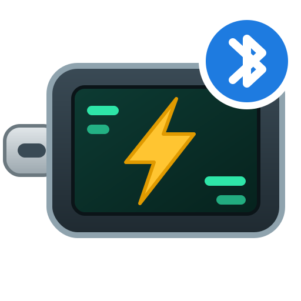

<p align="center"></p>

# TC66C USB meter for Home Assistant

A Home Assistant custom integration for the **RuiDeng / Riden TC66C** USB-C power meter (Bluetooth version).
It reads the meter over Bluetooth, directly from the Home Assistant host or through **ESPHome Bluetooth proxies**, and
tracks charge sessions, for example to see how much energy a power bank took and get a notification when it is full.

The repository also contains a small stand-alone **web app** that reads the meter from Chrome on a laptop (Web Bluetooth).

> Not affiliated with RuiDeng/Riden. The protocol is based on [rd-usb](https://github.com/kolinger/rd-usb) by kolinger.

## Features

- Voltage, current, power, temperature, both energy/charge counters of the meter (group 0 and group 1),
  load resistance and D+/D− voltages (the last three are disabled by default to save database writes).
- **Charge sessions** calculated by Home Assistant: energy (Wh), charge (mAh), duration and start time, plus a
  `Charging` binary sensor. The amount is taken from the meter's own counter where possible, so readings missed by
  Home Assistant still count. A running session survives a restart or reload of Home Assistant.
- **Event `tc66c_charging_finished`** when charging stops, for notifications ("power bank full").
- Works through **ESPHome Bluetooth proxies**; every connection attempt picks the proxy with the best signal.
- Silent when the meter is off: no connection attempts and no errors in the log until a proxy hears it again.
- **Reconnect button** and an optional fallback retry every few minutes.
- **Diagnostic sensors**: connection status, signal strength, best proxy, the proxy holding the connection, proxies in
  range, connect time, failures, last error. Plus a full diagnostics download.
- UI translated in English and Dutch.

## Requirements

- Home Assistant **2026.3** or newer (needed for the integration icon; the rest works on recent versions too).
- The Bluetooth integration with a local adapter or ESPHome Bluetooth proxies. For a proxy this is enough
  (it must be an *active* proxy, because the integration connects to the meter):

  ```yaml
  bluetooth_proxy:
    active: true
  ```

- A **TC66C with Bluetooth** (it advertises as `BT24-M`). The TC66 without "C" has no Bluetooth.

## Installation

### HACS (custom repository)

1. HACS → three dots → *Custom repositories*.
2. Add `https://github.com/jurgen2005/TC66C-Home-Assistant-integratie`, type *Integration*.
3. Install **TC66C USB meter** and restart Home Assistant.

### Manual

Copy `custom_components/tc66c` to `config/custom_components/tc66c` and restart Home Assistant.

## Setup

Switch the meter on. Home Assistant usually discovers it automatically (`BT24-M`). Otherwise add the integration
via *Settings → Devices & services → Add integration → TC66C USB meter* and pick it from the list (likely candidates
are marked with ★) or enter the MAC address.

**The meter accepts only one Bluetooth connection.** Close the web app or the phone app, otherwise Home Assistant
cannot connect.

### Options

| Option | Default | Meaning |
|---|---|---|
| Update interval | 5 s | How often the meter is read (2–3600 s). 10 s is plenty for charging and halves the database writes. |
| Charge threshold | 0.10 A | A session starts at this current. |
| End delay | 60 s | A session ends when the current stays below the threshold this long (or the meter is gone this long). |
| Retry after | 5 min | Fallback: retry the connection every this many minutes, even without a new advertisement (0 = off). |

## Entities

| Entity | Notes |
|---|---|
| Voltage, Current, Power | Measurements |
| Charge / Energy group 0 and 1 | The meter's own counters (mAh, mWh). Only the active group counts. |
| Charging (binary sensor) | On during a charge session |
| Charge session energy / charge / duration / start | Calculated by Home Assistant; attributes show status, end reason and method |
| Reconnect (button) | Drops the connection and reconnects right away |
| Temperature, connection diagnostics | Under *Diagnostic* on the device page |

### Groups 0 and 1

The TC66C has two counters. **Group 0** is per session: after a power cycle the old value is shown briefly and it starts
again from 0 as soon as more than 1 mAh flows. **Group 1** keeps counting across power cycles until you clear it.
Only the active group counts (the number on the main screen under DATA). Long press K2 to switch, long press K1 to clear.

## Notification when charging is finished

The event `tc66c_charging_finished` carries `energy_wh`, `charge_mah`, `duration_min`, `start`, `end`, `reason`,
`method` and `address`. `reason` is one of:

- `current below threshold`: the device is full (or stopped charging),
- `meter unreachable`: no readings for the end delay (unplugged, out of range),
- `interrupted: no readings for too long`: Home Assistant was down for more than 15 minutes during a session.

Example automation:

```yaml
alias: Power bank full (TC66C)
triggers:
  - trigger: event
    event_type: tc66c_charging_finished
actions:
  - action: notify.mobile_app_your_phone
    data:
      title: >-
        {{ 'Power bank full' if trigger.event.data.reason == 'current below threshold'
           else 'Charging stopped' }}
      message: >-
        {{ trigger.event.data.energy_wh }} Wh, {{ trigger.event.data.charge_mah }} mAh
        in {{ trigger.event.data.duration_min }} min ({{ trigger.event.data.reason }})
mode: queued
```

## Troubleshooting

- **Signal**: below about −85 dBm connections become unreliable; at −95 dBm and worse they mostly fail
  ("ESP_GATT_ERROR … Interference/range"). Move the meter closer to a proxy. The *Signal strength* sensor shows the
  last value before connecting (a connected meter does not advertise, so it cannot be measured during a connection).
- **Proxy Wi-Fi**: very long scan windows on an ESP32 proxy can starve its Wi-Fi. If the log shows
  "Ping response not received", check the proxy.
- **Does not come back after moving it**: press *Reconnect*, or keep the fallback retry enabled.
- Enable debug logging for details:

  ```yaml
  logger:
    logs:
      custom_components.tc66c: debug
  ```

## Web app

`webapp/tc66c-monitor.html` is a single HTML file that reads the meter from Chrome or Edge with Web Bluetooth, with a
live chart (with moving average), log, CSV export and a "charging finished" notification. Serve it from
`http://localhost` (for example `python3 -m http.server`) and open it in Chrome. The web app UI is in Dutch for now.

## Development

```bash
pip install -r requirements_test.txt
pytest
```

## Credits and license

- Protocol (AES key, packet layout) from [rd-usb](https://github.com/kolinger/rd-usb) by kolinger, GPL-3.0.
- Checksum handling as in sigrok's rdtech-tc driver.

This project is licensed under the **GNU General Public License v3.0**, see [LICENSE](LICENSE).
